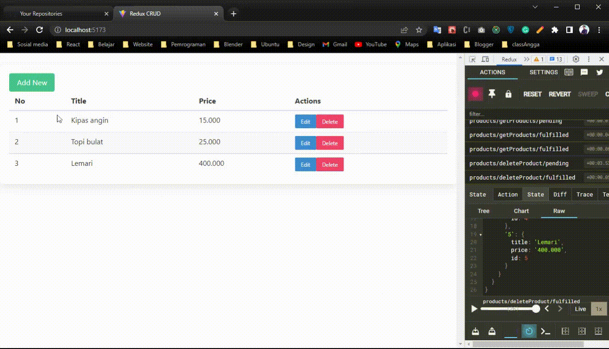

# React 3D Model

## `Preview Project 👇`

## `Built with`

- Nodejs
- React.js + Vite.js
- React Router
- Redux Toolkit
- Bulma
- Axios

## `Step by step to run this project`

### `clone`

You can clone by using git clone on your terminal:

    git clone https://github.com/tondeveloperr/CRUD-redux-toolkit.git

You can clone by click on the GitHub green button "CODE" and download the .zip

### `npm install`

This project depends on some dependencies, so the command **npm install** takes care of installing all of them

    npm install

### `Install JSON-Server`

This project uses JSON Server to provide a fake API. To install JSON Server globally, please run the following command:

    npm install -g json-server

After installing it, run JSON Server in your project with the following command:

    json-server --watch data/db.json --port 5000

Open [http://localhost:5000/products](http://localhost:5173/) to view it in the browser.

### `npm run dev`

Runs the app in the development mode.\
Open [http://localhost:5173/](http://localhost:5173/) to view it in the browser.

    npm run dev
